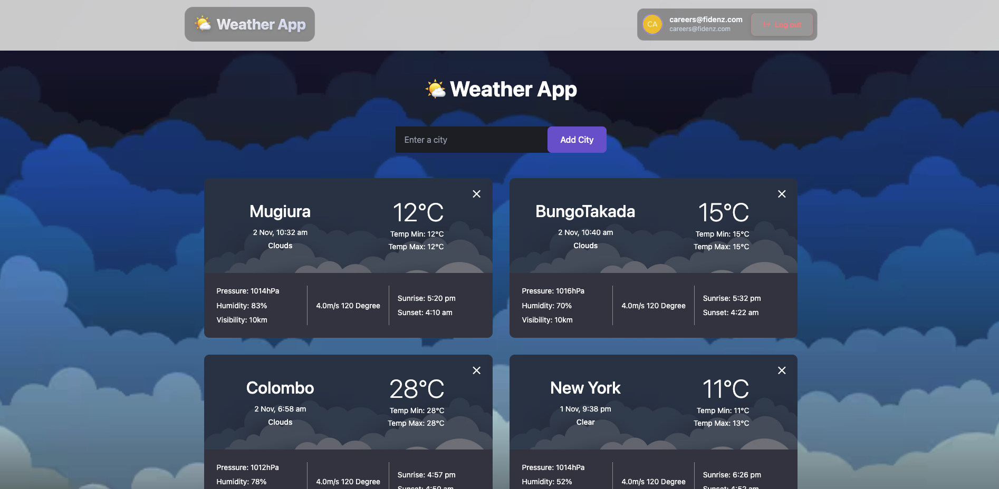
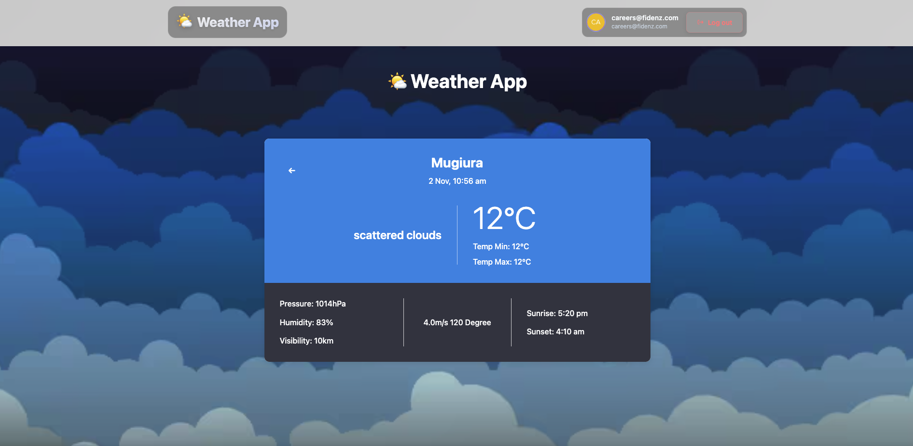
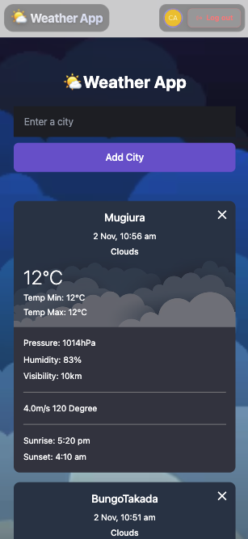

🌤️ Weather App
A secure weather application with authentication that displays weather information for predefined cities.

📋 Features
🔐 Auth0 Authentication with login/logout

📧 Multi-Factor Authentication via email verification

🌤️ Weather Data for multiple cities

💾 5-minute caching for performance

📱 Responsive design for all devices

🛡️ Protected routes - login required

🛠️ Quick Setup
1. Install & Run
bash
npm install
npm run dev
2. Environment Setup
Create .env.local:

env
VITE_WEATHER_API_KEY=your_openweathermap_key
VITE_AUTH0_DOMAIN=your_auth0_domain
VITE_AUTH0_CLIENT_ID=your_auth0_client_id

3. Access App
Visit: http://localhost:5173

📸 Screenshots
### Weather Dashboard

### City 

### Mobile View

🏗️ Built With
React + TypeScript

Auth0 Authentication

OpenWeatherMap API

Vite

CSS3